<!-- Generated by GitHub Profile Agent Console. Edit profile.config.json, then run npm run generate. -->

  <picture>
    <source media="(max-width: 760px) and (prefers-color-scheme: dark)" srcset="./assets/hero/agent-console-e2124e67-mobile-dark.svg">
    <source media="(max-width: 760px)" srcset="./assets/hero/agent-console-e2124e67-mobile-light.svg">
    <source media="(prefers-color-scheme: dark)" srcset="./assets/hero/agent-console-e2124e67-dark.svg">
    <source media="(prefers-color-scheme: light)" srcset="./assets/hero/agent-console-e2124e67-light.svg">
    
  </picture>

  Builderman

	

    M o t o‎ ‎ ‎ Ｕｎｓｔｏｐｐａｂｌｅ　Lｅａｒｎｅｒ

  
  

## 📊 GitHub Activity Statistik

  

---

### 🔗 Portofolio
> Let me introduce myself. 

  
  
  

---

## 🧑‍💻 About Me

<table>
<tr>
<td width="50%" valign="top">

### 🇮 Bahasa Indonesia

Halo! Saya **Imanuel Ayub Flabianos**, seorang **Fullstack Developer** dari Indonesia. Saya saat ini menempuh pendidikan di bidang **Pengembangan Perangkat Lunak dan Gim (PPLG/RPL)**.

Saya passionate dalam membangun aplikasi web dan sistem yang fungsional, efisien, dan memiliki tampilan yang menarik. Fokus utama saya meliputi pengembangan **Web & System (Fullstack)**, **IoT**, **UI/UX Design**, serta **Database Architecture**.

Saat ini saya terus **belajar dan membangun** proyek-proyek baru untuk mengasah kemampuan dan menambah pengalaman.

</td>
<td width="50%" valign="top">

### 🇧 English

Hello! I'm **Imanuel Ayub Flabianos**, a **Fullstack Developer** from Indonesia. I'm currently studying **Software & Game Development (PPLG/RPL)**.

I'm passionate about building functional, efficient, and visually appealing web applications and systems. My main focus areas include **Web & System Development (Fullstack)**, **IoT**, **UI/UX Design**, and **Database Architecture**.

I'm constantly **learning and building** new projects to sharpen my skills and gain experience.

</td>
</tr>
</table>

---

## 🚀 Featured Repository

### 📌 [Project Management App]
> **Role**  
Fullstack Developer

* **Tech Stack:**

---

## 📈 Engineering Focus

[Game Development]	──► Make and Develop more Games.  
[Web Applications]	──► Building scalable backends with Laravel & PHP.  
[Database Systems]	──► Designing efficient MySQL schema & queries.  
[User Interface]	──► Creating clean layouts via Figma & Bootstrap.  
[IoT & Systems]		──► Exploring device-to-cloud integration.  

	
---

### My Absolute Favorites:

- 💻 &nbsp; I love exploring new tech stack and building cool stuffs, and playing Music
- 📰 &nbsp; Reading & writing tech blogs whenever possible.
- 🍕 &nbsp; Meetups & Tech events.

	
   
  
<b>⚙️ Things I use to get stuff done</b>

  	<ul>
  	    <li><b>OS:</b> Windows, Linux </li>
	    <li><b>Laptop: </b> Advan Workpro Lite (i3 12th gen)</li>
	    <li><b>Code Editor:</b> VSCode - The best editor out there.</li>
	    <li><b>Stay Updated:</b> Linkedin, Github and more.</li>
	     
	</ul>	

---

  Built with ❤️ by <b>Imanuel Ayub Flabianos</b> | © 2025

  

---
